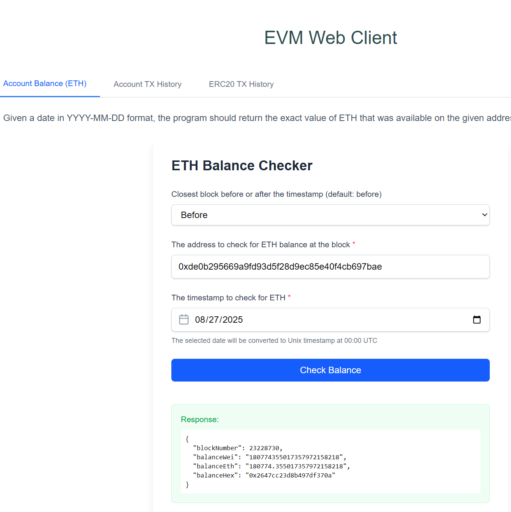
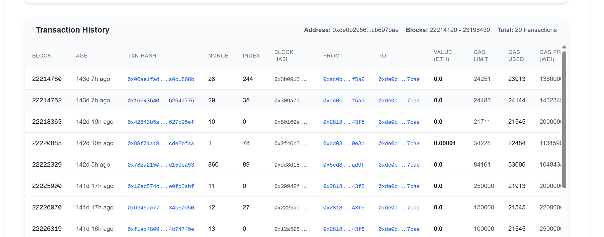
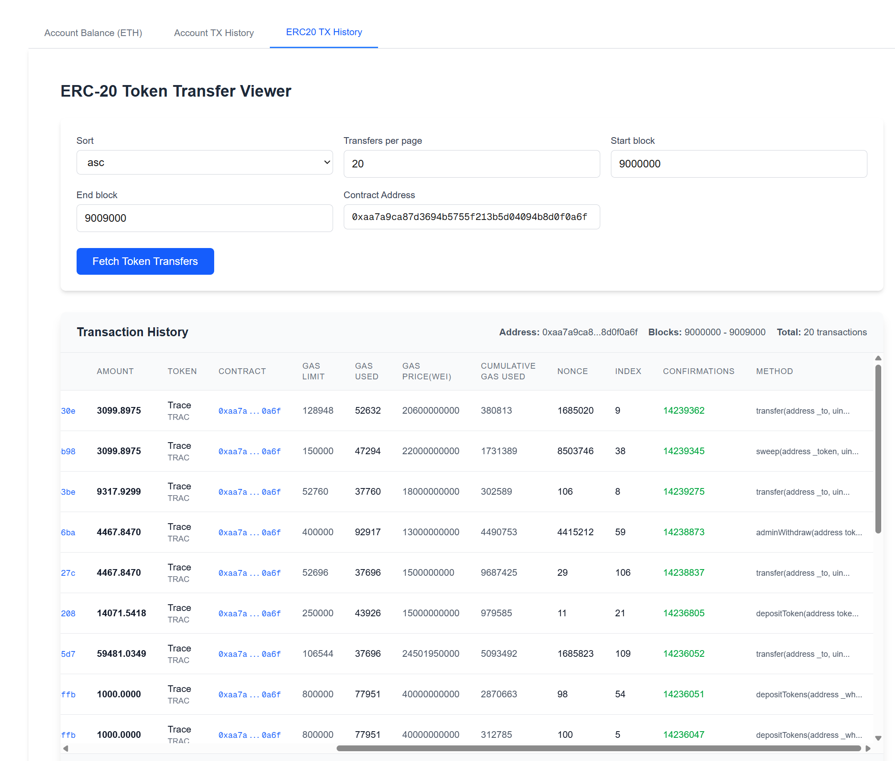

# EVM Indexer

## 📋 Table of Contents
1. [Prerequisites](#-1-prerequisites)
2. [Running the App](#️-2-running-the-app)
    - [Local (Node.js)](#locally-nodejs)
    - [Docker](#docker)
3. [URLs](#-3-urls)
4. [Screenshots & Demo](#-4-screenshots-and-demo)

---

## 📦 1) Prerequisites

* First, run the back-end server
* Check environment setup in `.env` file
    * **Note:** Docker and local development use different port settings
* Requirements:
    * [Node.js](https://nodejs.org/) v18+ (with npm installed) OR
    * [Docker](https://www.docker.com/)

---

## ▶️ 2) Running the App

### Locally (Node.js)

Install dependencies:
```bash
npm install
```

Start development server:
```bash
npm run dev
```

### Docker

Start the application:
```bash
docker compose -f compose.dev.yaml up
```

**Useful Docker Commands:**
```bash
# Build dev image
docker compose -f compose.dev.yaml build

# Stop and remove all running containers
docker kill $(docker ps -aq) && docker rm $(docker ps -aq)

# Free up space
docker system prune -af --volumes
```

---

## 🔗 3) URLs

* **Local development:** [http://localhost:3000](http://localhost:3000)
* **Docker:** [http://localhost:4000](http://localhost:4000)

---

## 📷 4) Screenshots and Demo




---


