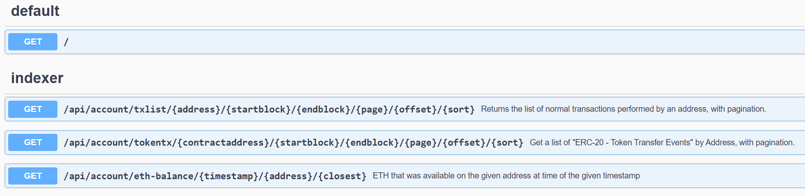
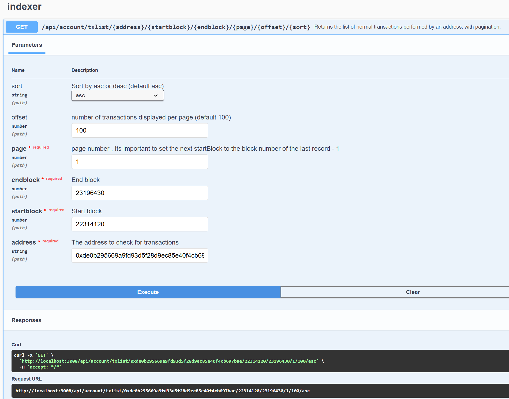
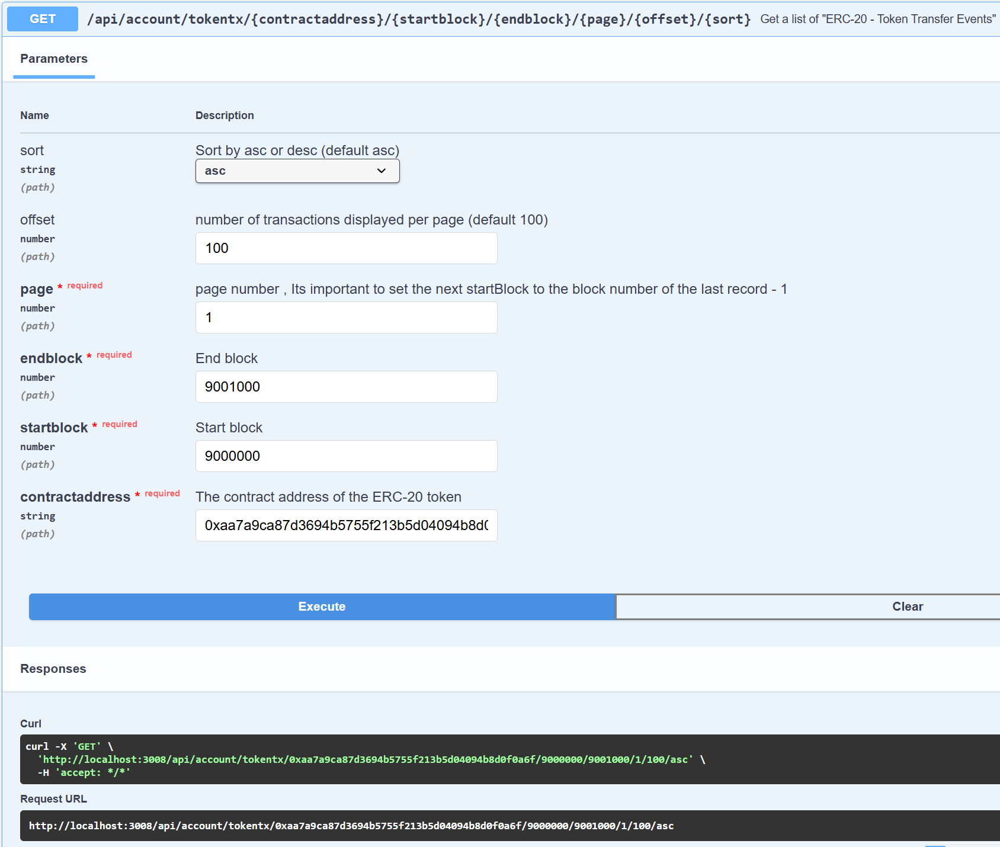
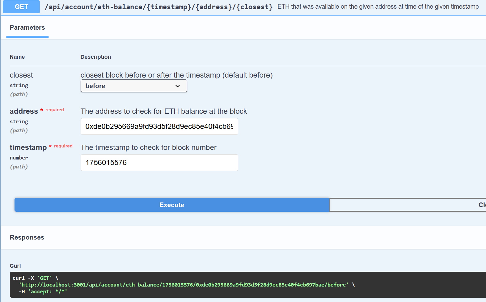

## 📑 Index

1. [🧩 EVM Indexer](#-evm-indexer)
2. [📦 Prerequisites](#-1-prerequisites)
3. [🚀 Running the App](#-2-a-running-the-app-with-docker)
    - [With Docker](#-2-a-running-the-app-with-docker)
    - [Locally (Node.js)](#-2-b-running-the-app-locally-nodejs)
    - [Setup](#-setup)
    - [Running the App](#-️running-the-app)
    - [Testing](#-testing-not-implemented-yet)
4. [🔗 Swagger UI](#-4--swagger-ui-local-3001--docker-3008-httplocalhost3008docs)
5. [🛠️ Tech Stack](#️-tech-stack)
    - [✅ Done](#-done)
    - [📝 Todo](#-todo)
6. [📷 Screenshots & Demo](#-5-screenshots-and-demo)
7. [📄 Extra Info](#-extra-info)
    - [🔍 Indexing On-Chain Data](#-indexing-on-chain-data)
    - [🔄 Ethereum Reorgs After The Merge](#-ethereum-reorgs-after-the-merge)
    - [⏱️ Ethereum Block Time](#️-ethereum-block-time--12s)


## 🧩 EVM Indexer

EVM Indexer is a **NestJS-based application** designed to **index and serve on-chain Ethereum data**.
It provides **APIs**, integrates with **Swagger UI** for documentation, and supports **Docker** for easy deployment.
The project also includes **validation**, **rate-limiting**, and other features.

---
## 📦 1) Prerequisites
* ENV setup (see `src/constants/etherscan.ts` and `src/constants/infura.ts`).
* [Node.js](https://nodejs.org/) v18+ (with [pnpm](https://pnpm.io/) installed) or [Docker](https://www.docker.com/).

## 🚀 2-a) Running the App with Docker

```bash
# development
# Swagger docs available at: http://localhost:3008/docs
$ docker compose -f docker-compose.dev.yml up

# or run with
$ pnpm run docker:dev
```

---

## 💻 2-b) Running the App Locally (Node.js)

### ⚙️ Setup

```bash
$ pnpm install
```

### ▶️ Running the App

```bash
# development
$ pnpm run start

# watch mode
$ pnpm run start:dev

# production mode
$ pnpm run start:prod
```

### 🧪 Testing (not implemented yet)

```bash
# unit tests
$ pnpm run test

# e2e tests
$ pnpm run test:e2e

# test coverage
$ pnpm run test:cov
```
## 🔗 4)  **Swagger UI (Local 3001 / Docker 3008):** [http://localhost:3008/docs](http://localhost:3008/docs)

---

## 🛠️ Tech Stack

* 📌 [NestJS](https://nestjs.com/)
* 📌 TypeScript
* 📌 Docker
* 📌 ESLint + Prettier
* 📌 Swagger UI
* 📌 Husky


#### ✅  Done

* ✅ Added **linter pre-commit hook** with Husky.
* ✅ Integrated **Swagger UI** for API documentation.
* ✅ Configured **ESLint + Prettier**.
* ✅ Implemented **rate-limiting** with `@nestjs/throttler` to prevent DDoS attacks.
* ✅ Added **DTO validation** with `class-validator` + `class-transformer`.
* ✅ Created **docker-compose** file for simplified app setup.

#### 📝 Todo

* 💡 "No transactions found" returns error 500! - should return 200 with empty array.
* 💡 Write unit & e2e tests.
* 💡 Add a **caching layer** (Redis, Memcached).
* 💡 Implement **API versioning**.
* 💡 Use an advanced logging system (e.g., Winston).
* 💡 Add **monitoring & alerting** (Prometheus, Grafana).
* 💡 Set up **CI/CD pipelines** with GitHub Actions.

---
##  📷 5) Screenshots and demo



```json
{
  "success": true,
  "data": {
    "transactions": [
      {
        "gasCost": "430900000000000",
        "effectiveGasPrice": "20",
        "blockNumber": "22314120",
        "hash": "0x7f6465d60b850c29ec59279da791656d2c4eb63765abe915b6c43bba7a67affe",
        "nonce": "40",
        "blockHash": "0xad9fba9edc39981550b8ed22e591e54dc060b0075460b09088fbe7985e58c8a4",
        "transactionIndex": "5",
        "from": "0x28180a5ddb79ca576b8be6a0b4decef270cc43f6",
        "to": "0xde0b295669a9fd93d5f28d9ec85e40f4cb697bae",
        "value": "0",
        "valueEth": "0.0",
        "gas": "21711",
        "gasPrice": "20000000000",
        "cumulativeGasUsed": "224372",
        "gasUsed": "21545",
        "confirmations": "910482",
        "timeStamp": "2025-04-21T01:34:47.000Z",
        "isError": false,
        "txReceiptStatus": true,
        "contractAddress": null,
        "methodId": "0x5c60da1b",
        "functionName": "implementation()"
      }
    ],
    "metadata": {
      "address": "0xde0b295669a9fd93d5f28d9ec85e40f4cb697bae",
      "blockRange": {
        "start": 22314120,
        "end": 23196430
      },
      "pagination": {
        "page": 1,
        "offset": 100
      },
      "sort": "asc",
      "count": 100
    }
  }
}
```


```json
{
  "success": true,
  "data": {
    "events": [
      {
        "blockNumber": "9000165",
        "hash": "0x33c1b2e953841743be6194cccd095e1d0879fd1451e60f3ab496be395966f8fc",
        "nonce": "1685020",
        "blockHash": "0x8671e198a24f6d4676ed6d4557b5104f8efbe95f78d75e0210c02583fcdf2f2b",
        "transactionIndex": "9",
        "from": "0x2b5634c42055806a59e9107ed44d43c426e58258",
        "to": "0x4b9bd78c99ed23b9fde5659ec7fde4def80c730e",
        "value": "3099897500000000000000",
        "gas": "128948",
        "gasPrice": "20600000000",
        "cumulativeGasUsed": "380813",
        "gasUsed": "52632",
        "confirmations": "14224461",
        "timeStamp": "2019-11-25T19:19:48.000Z",
        "contractAddress": "0xaa7a9ca87d3694b5755f213b5d04094b8d0f0a6f",
        "methodId": "0xa9059cbb",
        "functionName": "transfer(address _to, uint256 _value)",
        "tokenName": "Trace",
        "tokenSymbol": "TRAC",
        "tokenDecimal": "18",
        "gasCost": "1084219200000000",
        "effectiveGasPrice": "20"
      }
    ],
    "metadata": {
      "contractaddress": "0xaa7a9ca87d3694b5755f213b5d04094b8d0f0a6f",
      "blockRange": {
        "start": 9000000,
        "end": 9001000
      },
      "pagination": {
        "page": 1,
        "offset": 100
      },
      "sort": "asc",
      "count": 5
    }
  }
}
```



```json
{
  "success": true,
  "data": {
    "blockNumber": 23209045,
    "balanceWei": "180774355017357972158218",
    "balanceEth": "180774.355017357972158218",
    "balanceHex": "0x2647cc23d8b497df370a"
  }
}
```

---
## 📄 Extra Info

### 🔍 Indexing On-Chain Data

Some useful methods for indexing Ethereum data:

* Using third-party APIs like **Moralis** or **The Graph**.
* Connecting through **RPC nodes** (paid providers  offer better performance).
* Running your own **Ethereum node** with software like **Geth**.

### 🔄 Ethereum Reorgs After The Merge

📖 [Read more here](https://www.paradigm.xyz/2021/07/ethereum-reorgs-after-the-merge)

### ⏱️ Ethereum Block Time ≈ 12s

The Ethereum block time is \~12 seconds per block, meaning a new block is added every 12 seconds.
This timing is managed by Ethereum’s **consensus mechanism** to ensure stability and predictable transaction confirmations.
📊 [Etherscan Block Time Chart](https://etherscan.io/chart/blocktime)

