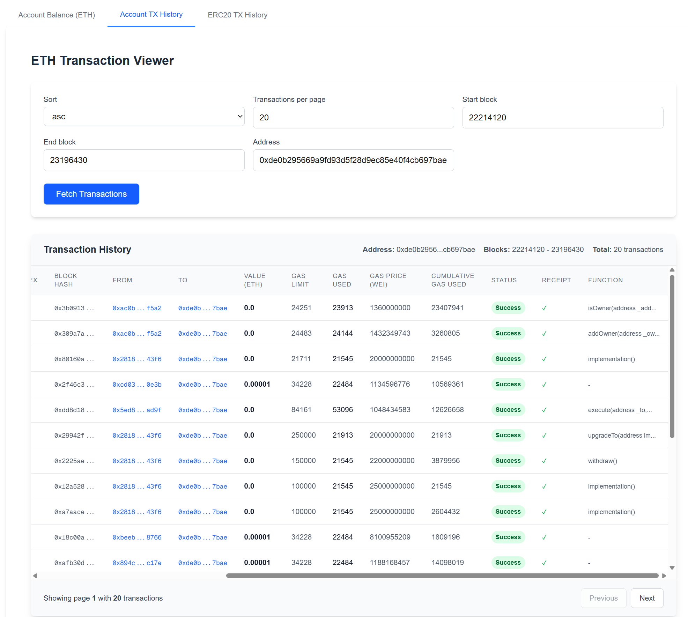

### EVM Data Viewer

1) Open the Backend folder and run the project.

Then, visit this link in your browser:

http://localhost:3008/docs

2) Open the Frontend folder and run the project.

Then, visit this link in your browser (the first load may take 10–15 seconds):

http://localhost:4000/

* Note: To keep things simple for this demo, I skipped some best practices — for example, I committed my apiKey and .env file to the Git history.

